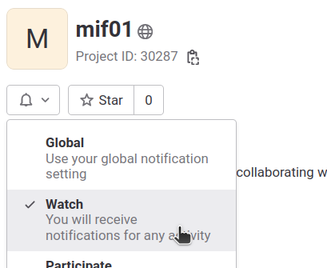

<!-- LTeX: language=fr -->
# Gestion de Projet et Génie Logiciel, M1, département informatique, Lyon 1, 2023-2024

## Dates importantes

<!-- [Cf. ADE](http://adelb.univ-lyon1.fr/direct/index.jsp?projectId=4&days=0,1,2,3,4&resources=33140&weeks=4,5). -->

* Emploi du temps : Cf. ADE.
  Utilisez la ressource "M1 informatique" **plus les groupes de TD** pour voir l'emploi du temps. Contrairement à la licence vous n'avez pas d'emploi du temps personnalisé il faut regarder celui de votre groupe.

* Rendu du TP noté : vous devez avoir rempli le champ URL de TOMUSS avant le 20 septembre 2023 (malus sur la note si ce n'est pas fait sans une raison valable). Le rendu final est le 17/12/2023 à 23h59. Voir
  [projet-note.md](projet-note.md) pour un récapitulatif des consignes.

* Examen : TODO: date à définir. 1h30 (sauf tiers-temps) Consignes : Seules 5
  feuilles A4 recto verso (donc 10 pages au total) sont autorisées à
  l’examen. Leur contenu est libre. Elles peuvent être une sélection de
  transparents ou manuscrites, avec une taille de caractère de votre
  choix. Les annales de l'examen sont dans le répertoire [exam/](http://matthieu-moy.fr/cours/mif01/exam/)
  et [sur l'ancienne page du
  cours](http://www.tabard.fr/cours/2017/mif01/). Prévoyez un stylo
  bleu foncé ou noir et un blanc correcteur.

* Session 2 : mêmes consignes que pour la session 1.

Barème : 40% examen / 60% TP (une note pour le rapport, une note pour le code). Seul l'examen est rattrapable en session 2.

## Enseignants et contacts

* [Matthieu Moy](https://matthieu-moy.fr/) (responsable du cours)
* [Lionel Medini](https://perso.liris.cnrs.fr/lionel.medini/)
* [Joël Felderhoff](https://perso.jfelderhoff.fr/)
* [Mathieu Hilaire](https://liris.cnrs.fr/page-membre/mathieu-hilaire)

## Enseignement présentiel, vidéos et messagerie instantanée

En complément des séances en présentiel, les étudiants qui le souhaitent peuvent utiliser les vidéos préparées en 2020 pour les cours magistraux (disponibles sur la plateforme My Video Lyon 1, et sur la [playlist youtube](https://www.youtube.com/playlist?list=PL6-YbcqXawf5ED3NHDZYejWJaAschnrO0)). Attention, le contenu du cours a un peu évolué depuis, regarder les vidéos ne dispense pas de venir en CM !

Vous pouvez interagir avec les enseignants via le système d'issues de GitLab (qui n'est pas vraiment prévu pour cela mais peut être détourné pour en faire un petit forum) : https://forge.univ-lyon1.fr/matthieu.moy/mif01/-/issues. Pour poser une question, créez une nouvelle issue (une issue par question). Il y a une entrée dédiée « cherche binôme » si vous êtes à la recherche d'un binôme. Pour être informé de l'activité (nouveaux commentaires, etc), réglez les notifications sur « watch » en cliquant sur la cloche sur la page d'accueil du projet :

## Nouvelles du cours

Les informations de dernière minute sont disponibles ici :
[NEWS.md](NEWS.md). Les informations importantes seront envoyées par
email, ce fichier en contient une copie.

## CM 1 (13/9/2023, 8h) : Introduction

### Intro du cours

* Vidéo : 

* Transparents : [00-intro-cours-slides.pdf](http://matthieu-moy.fr/cours/mif01/00-intro-cours-slides.pdf) (version imprimable : [00-intro-cours-handout.pdf](http://matthieu-moy.fr/cours/mif01/00-intro-cours-handout.pdf))

### Introduction au génie logiciel

* Vidéo : 

* Transparents : [01-introduction-slides.pdf](http://matthieu-moy.fr/cours/mif01/01-introduction-slides.pdf) (version imprimable : [01-introduction-handout.pdf](http://matthieu-moy.fr/cours/mif01/01-introduction-handout.pdf))
  
## TP 1 (13/9/2023, 9h45) : Mise en route Java

* Énoncé : [TP1-java/README.md](TP1-java/README.md)

* Salles :
  - Nautibus TP 1, Nautibus TP 2: Matthieu Moy
  - Nautibus TP 3, Nautibus TP 4: Joel Felderhoff
  - Nautibus TP 5, Nautibus TP 6: Lionel Medini
  - Nautibus TP 9, Nautibus TP10: Mathieu Hilaire

## CM 2 (13/9/2023, 14h) : Outillage : Maven, la forge Gitlab, intégration continue, coding style ... 

### Maven, Forge, Intégration Continue

* Vidéo : 

* Transparents : [02-cm-maven-forge-ic-slides.pdf](http://matthieu-moy.fr/cours/mif01/02-cm-maven-forge-ic-slides.pdf)
  (Version imprimable : [02-cm-maven-forge-ic-handout.pdf](http://matthieu-moy.fr/cours/mif01/02-cm-maven-forge-ic-handout.pdf))

## TP 2 (13/9/2023, 15h45) : Outillage

* Énoncé : [TP2-outils/README.md](TP2-outils/README.md)

* Salles : comme le matin.

## TP 3 (20/9/2023, 9h45) : Outillage (suite)

* Énoncé : continuer [TP2-outils/README.md](TP2-outils/README.md)

* Salles :
  - Nautibus TP 1, Nautibus TP 2 : Matthieu Moy
  - Nautibus TP 3, Nautibus TP 4 : Joel Felderhoff
  - Nautibus TP 5, Nautibus TP 6 : Lionel Medini
  - Nautibus TP 9, Nautibus TP10 : Mathieu Hilaire

## CM 3 (20/9/2023, 11h30, par Lionel Medini) : Coding style, Design patterns (début)

### Coding style

* Vidéo : 

* Transparents : [03-coding-style-slides.pdf](http://matthieu-moy.fr/cours/mif01/03-coding-style-slides.pdf)
  (version imprimable : [03-coding-style-handout.pdf](http://matthieu-moy.fr/cours/mif01/03-coding-style-handout.pdf))

### Design patterns

* Slides : [CM-patterns.pdf](https://perso.liris.cnrs.fr/lionel.medini/enseignement/M1IF01/CM-patterns.pdf)

* Vidéo du mardi 8/9/2020 sur Youtube : [https://youtu.be/oal57dd73nY](https://youtu.be/oal57dd73nY)

* Vidéo du mercredi 9/9/2020 sur Youtube : [https://youtu.be/9oV0xDSrXes](https://youtu.be/9oV0xDSrXes)

## CM 4 (20/9/2023, 14h, par Lionel Medini) : Design patterns (suite)

## TD 1 (20/9/2023, 15h45) : Design patterns

* [TD1-design-patterns](http://matthieu-moy.fr/cours/mif01/TD1-patterns/TD-design-patterns.html)

* Salles : cf. TOMUSS et mail envoyé pour les étudiants.
  - Nautibus TD 2 : Matthieu Moy
  - Nautibus TD 3 : Joel Felderhoff
  - Nautibus TD12 : Lionel Medini
  - Nautibus TD13 : Mathieu Hilaire

## CM 5 (11/10/2023, 8h) : Métaprogrammation, spécifications et cas d'utilisation

### Métaprogrammation

* Vidéo : 

* Transparents [07-metaprogramming-slides.pdf](http://matthieu-moy.fr/cours/mif01/07-metaprogramming-slides.pdf)
  (version imprimable : [07-metaprogramming-handout.pdf](http://matthieu-moy.fr/cours/mif01/07-metaprogramming-handout.pdf))

### Spécifications

* Vidéo : 

* [05-UML-CU.pdf](http://matthieu-moy.fr/cours/mif01/05-UML-CU.pdf)

## TP 4 (11/10/2023, 9h45) : Design patterns & refactoring

* [TP3-patterns/README.md](TP3-patterns/README.md) et de l'aide avec [MVC](TP3-patterns/mvc.md)

* Salles :
  - Nautibus TP 4, Nautibus TP 5 : Matthieu Moy
  - Nautibus TP 6, Nautibus TP10 : Joel Felderhoff
  - Nautibus TP11, Nautibus TP12 : Lionel Medini
  - Nautibus TP13, Nautibus TP14 : Mathieu Hilaire

## CM 6 (18/10/2023, 8h) : Test

* [Transparents de Sandrine Gouraud](http://matthieu-moy.fr/cours/mif01/gouraud_20221005.pdf)

* [Software Fail Watch, 5th
  edition](https://www.tricentis.com/wp-content/uploads/2019/01/Software-Fails-Watch-5th-edition.pdf)
  présenté pendant le cours.

## TD 2 (18/10/2023, 9h45) : Coding styles, spécifications et agilité

* [TD2-uc-style/TD-usecase-et-style.pdf](http://matthieu-moy.fr/cours/mif01/TD2-uc-style/TD-usecase-et-style.pdf)
  (corrigé : [TD2-uc-style/TD-usecase-et-style-corrige.pdf](http://matthieu-moy.fr/cours/mif01/TD2-uc-style/TD-usecase-et-style-corrige.pdf))

* Salles : TODO

## CM 7 (8/11/2023, 8h) : introduction à l'agilité

### Introduction à l'Agilité

* Vidéo : 

* Transparents : [08-agilite-slides.pdf](http://matthieu-moy.fr/cours/mif01/08-agilite-slides.pdf)
  (version imprimable : [08-agilite-handout.pdf](http://matthieu-moy.fr/cours/mif01/08-agilite-handout.pdf))

## TP 5 (8/11/2023, 9h45): Design patterns & refactoring, suite

* Continuer avec : [TP3-patterns/README.md](TP3-patterns/README.md) et de l'aide avec [MVC](TP3-patterns/mvc.md)

* Salles :
  - Nautibus TP 1, Nautibus TP 2 : Matthieu Moy
  - Nautibus TP 3, Nautibus TP 4 : Joel Felderhoff
  - Nautibus TP 5, Nautibus TP 9 : Lionel Medini
  - Nautibus TP10, Nautibus TP11 : Mathieu Hilaire

## CM 8 (15/11/2023, 8h) : Agilité (suite)

### Fin du cours sur l'agilité

* Vidéo : 

* Transparents : [08-agilite-slides.pdf](http://matthieu-moy.fr/cours/mif01/08-agilite-slides.pdf)
  (version imprimable : [08-agilite-handout.pdf](http://matthieu-moy.fr/cours/mif01/08-agilite-handout.pdf))

### Agilité et passage à l'échelle : la méthode Spotify (transparents de Levent Acar)

* Vidéo : 

* Transparents : [Présentation_spotify_v2.pdf](http://matthieu-moy.fr/cours/mif01/Présentation_spotify_v2.pdf)

## TP 6 (15/11/2023, 9h45) : Tests

* Énoncé : [TP4-tests/README.md](TP4-tests/README.md)

* Salles :
  - Nautibus TP 1, Nautibus TP 2 : Matthieu Moy
  - Nautibus TP 3, Nautibus TP 4 : Joel Felderhoff
  - Nautibus TP 5, Nautibus TP 6 : Lionel Medini
  - Nautibus TP 9, Nautibus TP11 : Mathieu Hilaire

## CM 9 (6/12/2023, 8h) : Éthique

### Éthique

* Vidéo : 

* Transparents : [10-ethics-slides.pdf](http://matthieu-moy.fr/cours/mif01/10-ethics-slides.pdf)
  (version imprimable : [10-ethics-handout.pdf](http://matthieu-moy.fr/cours/mif01/10-ethics-handout.pdf))

## TP 7 (6/12/2023, 9h45) : Tests (suite)

* Sujet : continuer avec [TP4-tests/README.md](TP4-tests/README.md)

* Salles :
  - Nautibus TP 1, Nautibus TP 3 : Matthieu Moy
  - Nautibus TP 4, Nautibus TP 5 : Joel Felderhoff
  - Nautibus TP 6, Nautibus TP 9 : Lionel Medini
  - Nautibus TP10, Nautibus TP11 : Mathieu Hilaire

## CM 10 (13/12/2023, 8h) : Gestion de projet en entreprise

Intervention de Jonathan BENZAQUEN.

## TP 8 (13/12/2023, 9h45) : fin du projet

Cette dernière séance devrait vous permettre de boucler votre projet, qui est à rendre quelques jours plus tard.

* Salles :
  - Nautibus TP 1, Nautibus TP 2 : Matthieu Moy
  - Nautibus TP 3, Nautibus TP 4 : Joel Felderhoff
  - Nautibus TP 5, Nautibus TP 6 : Lionel Medini
  - Nautibus TP 9, Nautibus TP10 : Mathieu Hilaire

## 17/12/2023, 23h59 : date limite pour le rendu de projet.
